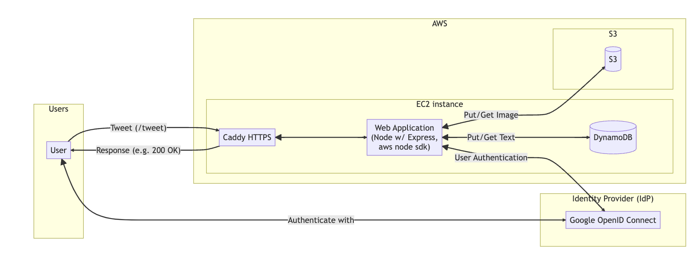
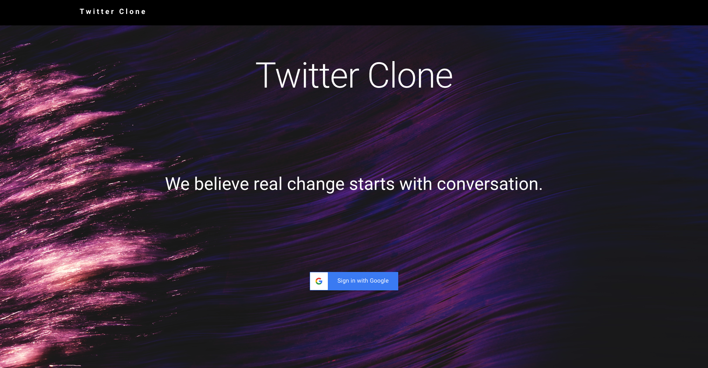
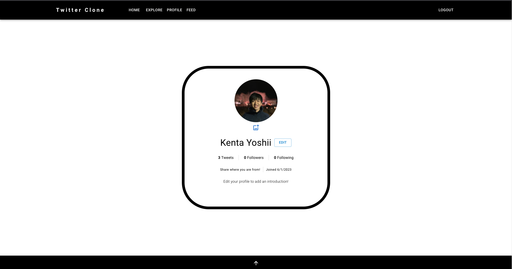
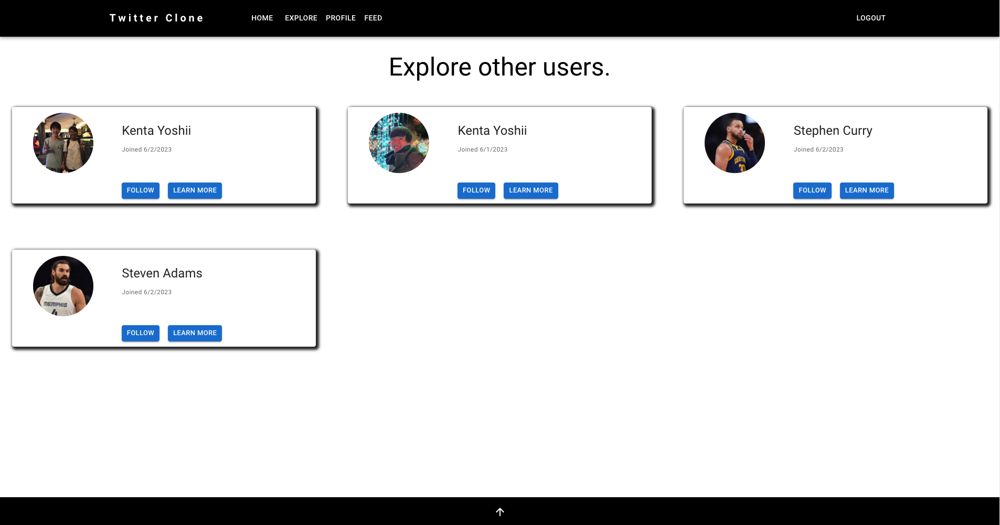
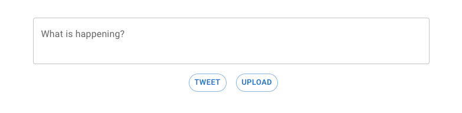
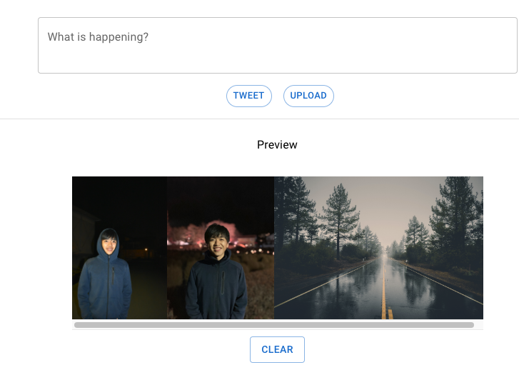
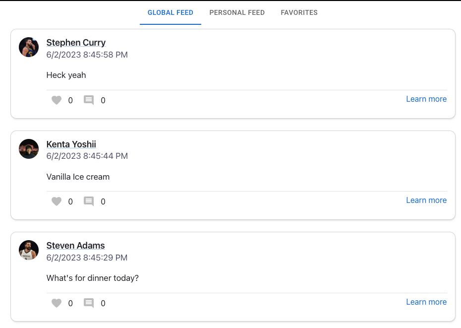

# About
## Overview
- Twitter-clone is a Twitter like SNS app that I built using `TypeScript` for backend and
`React` for frontend.
- `Amazon S3` is used for storing images
- `Amazon DynamoDB` is used for storing other data
- `Redis` is used to store clients' session information
- `Google Open ID connect` is used for client authentication

# Features
- When first accessing, you are directed to login page

- Upon logging in, you can either go to
    - __Profile Page__
        - You can edit your profile here
    - __Home Page__
        - You can tweet or view your own tweets
    - __Explore Page__
        - You can see all the other users
    - __Feed Page__
        - _Global Feed_
            - View tweets by all users
        - _Personal Feed_
            - View tweets by users you follow
        - _Favorites_
            - View tweets that you liked
## Profile Page

- View basic informatio about yourself
- You can edit to add
    - country, introduction and favorite color
- By default profile image is set to the same image that is used in logged in user's google account
- You can also upload a new image to change your profile image
## Explore Page
 
- View all the users using the app
- You can follow/unfollow an user from here
- You can also click on "Learn More" to see their version of Profile Page (like the one above)


## Home Page
- Post tweet/View tweets posted by you
- To post, use the text field

- An example tweet looks like this

- You can click on Username to jump to their Profile Page
- You can click on top right Pencil icon to Edit/Delete the Tweet

- Click on heart icon to like the tweet
- Click on Learn more to see who has like the tweet / add a comment to the tweet

- It also supports tweets with images. Simply click on upload to select up to 4 images

## Feed Page
- You have access to three different feeds

- Global Feed = displays all tweets
- Personal Feed = only display tweets from users you follow
- Favorites = only display tweets you liked
# Getting Started
## Running Locally
- Install all the modules for frontend and backend. From the root
```
cd twitter-clone-clinet 
yarn install
```
```
cd twitter-clone-server
yarn install
```
- Create `.env` file and add the following environmental variables
```shell
PORT=7000
NODE_ENV=development
SESSION_SECRET=<Your Choice>
DYNAMODB_REGION=<Your Choice>
TABLE_NAME=twitter-clone
GSI1_NAME=EntityIndex
GSI2_NAME=EntityValueIndex
GOOGLE_CLIENT_ID=<Your Choice>
GOOGLE_CLIENT_SECRET=<Your Choice>
GOOGLE_REDIRECT_URI=http://localhost:7000/auth/callback
DYNAMODB_ACCESS_KEY_ID=<Your Choice>
DYNAMODB_SECRET_ACCESS_KEY=<Your Choice>
BUCKET_NAME=twitter-clone
```
- Export AWS dummy credentials 
```
export AWS_ACCESS_KEY_ID=MINIOTEST
export AWS_SECRET_ACCESS_KEY=MINIOTEST
unset AWS_SESSION_TOKEN
```
- In the root, start the local dynamoDB server, minio, and Redis
```
docker-compose up -d
```
- Finally build the frontend
```
//in twitter-clone-client
yarn build
mv ./build ../twitter-clone-server/
```
- Start the backend. Use --c to create a new table. --d to delete the existing table.
```
//in twitter-clone-server
yarn start [--c] [--d]
```
- Express will serve the static files
- Access `localhost:7000`
## Deploy it on EC2
- If you have access to EC2, you can also run it there.
- Create a DynamoDB table and indexes (Refer to ./src/database/db_table.ts)
- Create a S3 bucket
- Set the NODE_ENV on server's .env to PRODUCTION 
- Use Caddy for https server
- Proxy it to port 7000 where your express app will be running.
